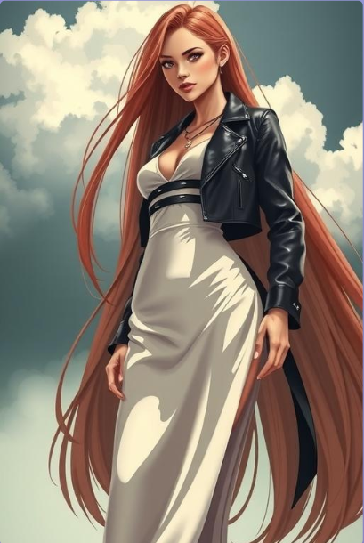
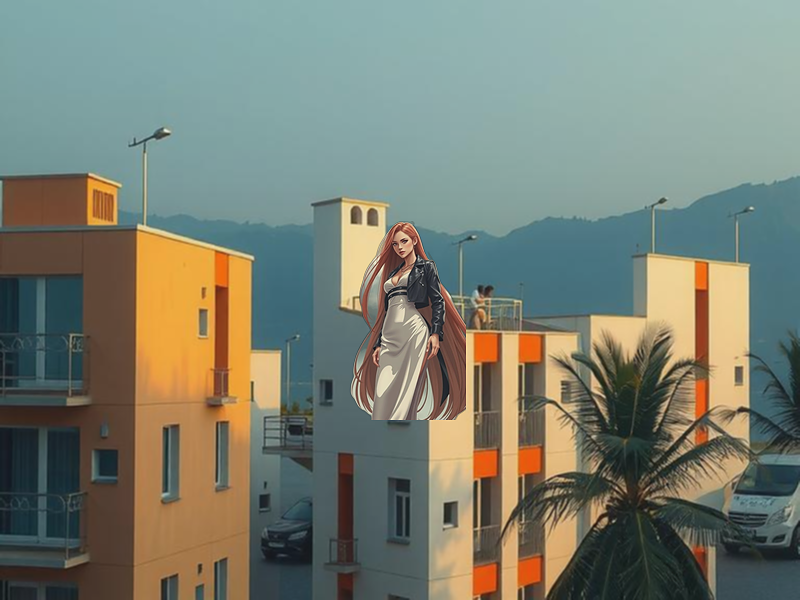
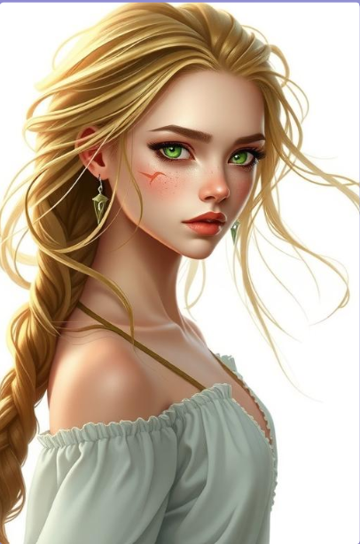
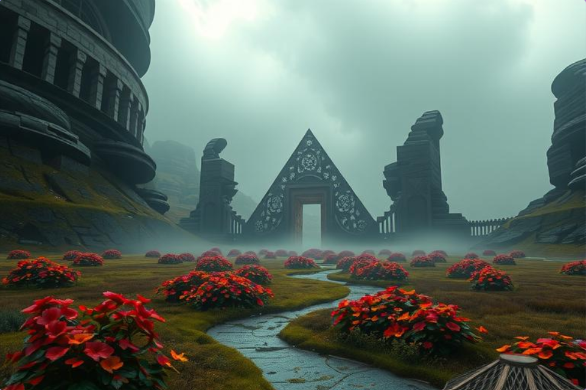
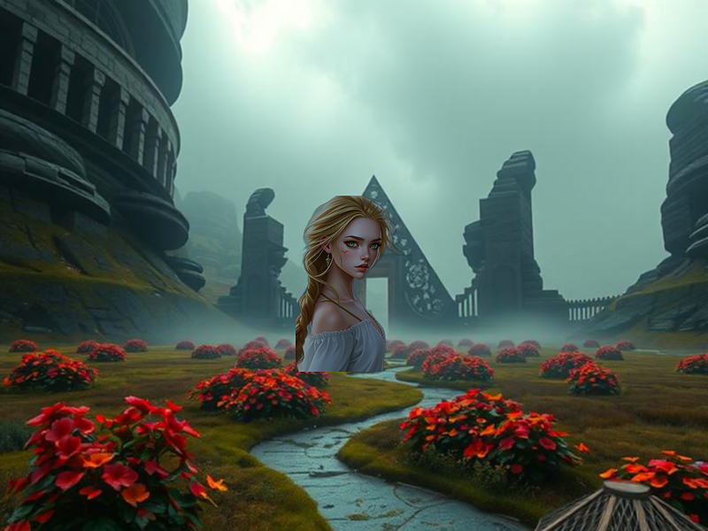
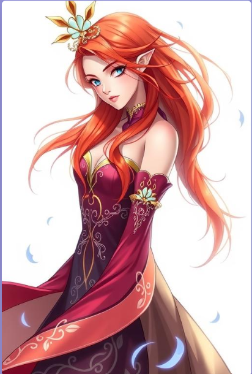
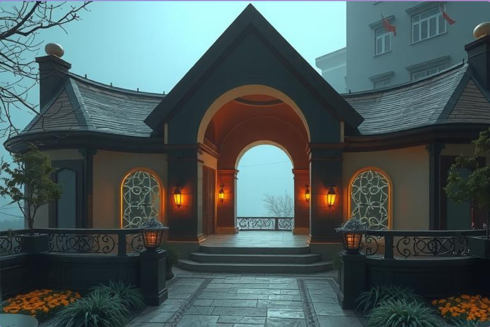
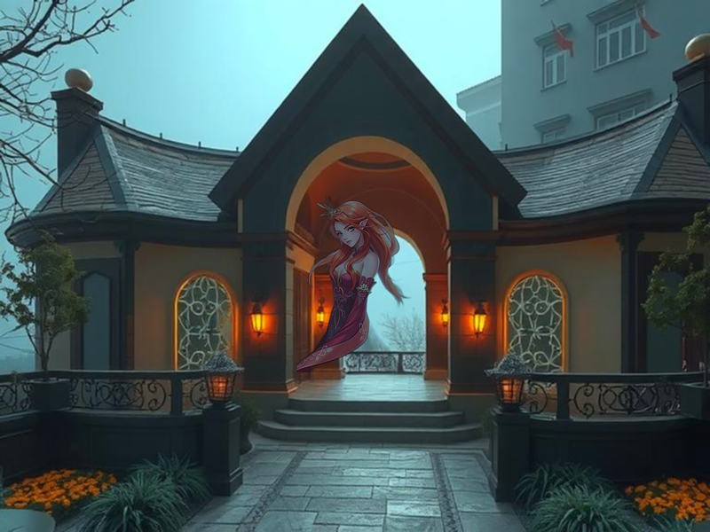

# Sample Inputs and Outputs
## Example 1:

### Prompt: 
Her mission was simple yet perilous: to retrieve a vital piece of technology called the 'Night Shield'
### Genre: 
Drama
### Generated Story: 
The desolate wasteland stretched as a canvas of emptiness, littered with the skeletal remains of shattered machines. Rain, a meager drizzle, clung to the cracked windows of a forgotten building, reflecting a distorted image of the desolate landscape.

A lone figure, a young woman named Anya, emerged from the shadows, her eyes hardened with resolve. Her sleek, rain-soaked cloak contrasted starkly against her pale skin, highlighting the urgency in her gaze.

Anya's mission was simple yet perilous. The Night Shield, a technological marvel that held the key to a better future, lay hidden within the ruins of a research facility, a victim of an ancient war. Her task was to retrieve it and ensure it reached its intended destination—a hidden vault in the capital city, a sanctuary of hope for humanity.

Her heart hammered against her ribs, a constant reminder of the stakes involved. She had to tread carefully, for the facility was shrouded in an eerie silence, haunted by the ghosts of the past.

As Anya ventured deeper into the wasteland, she encountered a band of scavengers, wary but not hostile. They shared her determination and offered her food and a safe haven for her brief stay.

Days blurred into nights, each marked by a new challenge. Anya faced treacherous traps, navigated perilous corridors, and outsmarted wary creatures. Yet, her resolve never wavered.

Finally, she reached the ruins of the research facility. Dust-covered control panels and shattered research equipment lay scattered around a hidden chamber. Anya's heart raced as she searched for the Night Shield, her fingers tracing the ancient symbols etched into the console.

With trembling hands, she activated a hidden hatch, and the door creaked open, revealing a chamber filled with the gleaming Night Shield. The weight of its significance settled heavily in her palm.

As she turned to leave, a voice echoed in her ears, "The shield has awoken. It demands a sacrifice." Anya knew this meant she had failed, but she refused to surrender. She had come too far to give up now.

With newfound determination, Anya activated the shield, its energy coursing through her body. A blinding light filled the chamber, followed by a deafening silence. When the light faded, Anya stood amidst a swirling vortex of energy, the Night Shield resting in her outstretched palm.

She had retrieved the crucial artifact, but her journey was far from over. She had to find a way to return to the capital city, a journey fraught with danger. Her heart raced, but her eyes shone with a newfound resolve.

### Character Description: 
Anya was a young woman with sharp features and a resolute demeanor. She possessed a strong will and an unwavering determination that burned brightly within her. Her pale skin, framed by long, flowing hair, was a stark contrast to her piercing blue eyes, which held an aura of unwavering focus.

Born into a society plagued by war and uncertainty, Anya had grown into a resilient and resourceful individual. Her unwavering focus on her mission, coupled with her thirst for knowledge, made her an exceptional survivor.

### Character Image:

### Background Description:
The world Anya inhabited was a post-apocalyptic wasteland, a haunting testament to humanity's fallen civilization. The desolate landscape stretched endlessly across scarred terrain, littered with the twisted metal skeletons of ancient machines and the crumbling remains of what were once thriving research complexes. Rain fell in perpetual drizzles, washing over cracked concrete foundations and rusted steel beams, creating mirror-like puddles that reflected the perpetually gray, overcast sky.
Forgotten buildings dotted the barren expanse like broken teeth, their shattered windows serving as vacant eyes staring into nothingness. The ruins of scientific facilities stood as solemn monuments to technological ambition turned catastrophic, their once-pristine laboratories now transformed into graveyards of broken equipment and dust-covered control panels etched with indecipherable symbols from a bygone era.
This harsh environment was occasionally punctuated by small pockets of life—hidden settlements where hardy scavengers gathered around flickering fires, offering brief respites of warmth and human connection in an otherwise cold and unforgiving world. The distant capital city remained a beacon of hope on the horizon, a heavily fortified sanctuary that promised salvation for those brave enough to traverse the treacherous wasteland.
The very air seemed heavy with the ghosts of the past, where eerie silences were broken only by the mournful whisper of wind through abandoned corridors.

### Background Image

### Combined Scene

## Example 2:

### Prompt: 
A mysterious door appears in the middle of nowhere
### Genre: 
Fantasy
### Generated Story:
A shimmering portal, pulsating with an ethereal glow, stood ominously in the middle of nowhere. It was an enigma, an invitation to an unknown realm, an enigma that beckoned adventurers and seekers with equal fervor.

A lone traveler, Lyra, with eyes ablaze with wanderlust and a heart filled with adventure, stumbled upon the portal on a whim. Driven by an insatiable yearning for discovery, she dared to step through its shimmering embrace.

The portal spat her out onto a vast, desolate landscape bathed in an eerie twilight. Towering mountains rose into the heavens, their slopes adorned with moss and lichen. The air hung heavy with the scent of damp earth and the faintest hint of decay.

A sense of exhilaration and trepidation washed over Lyra as she took in the unfamiliar sights and sounds. She wandered through the desolate landscape, her senses heightened. The silence was deafening, broken only by the rustle of leaves and the distant murmur of a stream.

Days bled into nights, and Lyra's determination never wavered. She encountered only creatures of the imagination - mischievous pixies, wise centaurs, and ethereal dragons with wings shimmering like moonlight. She encountered a cast of characters, each with their own tale to tell, their own secrets to keep.

One evening, under a canopy of stars, Lyra stumbled upon a hidden cave. Inside, she discovered a chamber filled with ancient artifacts – enchanted weapons, crumbling maps, and forgotten texts. The chamber's secrets revealed a hidden society, a forgotten civilization that once thrived in this very land.

As Lyra delved deeper into the cave, she uncovered an ancient prophecy that spoke of a guardian of the portal – a being of pure light and darkness. With newfound resolve, Lyra prepared to face the unknown.

### Character Description:
Name: Lyra, a restless soul with an insatiable thirst for adventure.

Appearance: Petite and agile, with piercing eyes that flicker with determination. She favors light-colored clothing that allows her to blend seamlessly into various landscapes.

Personality: Driven and adventurous, with an unwavering desire to discover the world's mysteries. She is fiercely independent and self-reliant, but she is also fiercely loyal to her friends.

Background: Orphaned as a child, Lyra grew up in a small village, where she learned the ways of the forest and the secrets of the ancient artifacts.

Motivation: To unravel the mysteries surrounding the portal and prove herself as a worthy adventurer.

Skills: Expert tracker, survivalist, hunter, inventor.

### Character Image:

### Background Description:
World: The world is an ethereal realm, cloaked in mystery and veiled in darkness. Strange, ancient beings guard the portal, ensuring that only those worthy can cross its threshold.

History: Legends spoke of a civilization that existed before the portal, a society of wise scholars and guardians of knowledge. Their disappearance led to the portal's creation, a beacon of hope for those seeking a glimpse of another world.

Society: A diverse and ancient society exists beyond the portal, divided into powerful guilds of scholars, warriors, and healers.

### Background Image

### Combined Scene

## Example 3:

### Prompt: 
A librarian discovers a magical book
### Genre: 
Fantasy
### Generated Story:
The weathered oak doors creaked open with a rusty groan, revealing a dusty, cobweb-laden chamber. Sarah, the librarian, stumbled into the darkness, a shiver running down her spine. Her heart hammered against her ribs like a frantic bird trapped in a cage.

She clutched the ancient book in her trembling hand, its leather cover cracked and worn. It was inscribed with swirling symbols she had never seen before. She had stumbled upon a legend whispered amongst the old books of the library - a magical book, a portal to another world.

Her fingers trembled as she flipped open the book, a cold wind rushing through her hair. The air was thick with the scent of forgotten pages and the faintest hint of magic. She knew she had to protect this precious relic, its secrets too precious to be shared.

Days bled into nights, the book her only solace. She would spend hours poring over its pages, deciphering the cryptic symbols and cryptic scripts. Her determination grew with each passing day.

One stormy night, a strange energy surged through the book, illuminating Sarah's face. She gasped, a surge of excitement coursing through her body. The book was alive! Its pages whispered secrets, revealing stories of a forgotten land, a world bathed in the soft light of a thousand candles.

She knew this was her calling, her destiny. She had to share this knowledge with the world, to warn people of the hidden realm beyond the veil. But fear gnawed at her, a constant reminder of her solitude and the danger she faced.

### Character Description:
Name: Anya, a young woman with fiery hair that tumbled down her shoulders and eyes that mirrored the sky.

Appearance: Anya was a stunning mix of fiery and serene. Her porcelain skin held a hint of pale blue, her eyes shone with an intelligence that seemed to burn with an endless potential. Her slender frame was built for adventure, her long limbs and sharp features adapted for the life she led.

Background: Anya grew up in a bustling city, surrounded by the bustle of life. Her childhood was filled with books and stories, her imagination her only escape from the concrete jungle. Her parents, both scholars, nurtured her thirst for knowledge, exposing her to the wonders of history, science, and the arts.

Motivation: Anya's primary motivation was the desire to protect the world from a looming darkness. She believed that the magic of the book could offer a beacon of hope and inspire a new generation to fight for a better future.

Skills: Anya possessed an uncanny ability to learn languages, her vast knowledge spanning multiple cultures and eras. She was also a gifted scholar, her thirst for knowledge insatiable.
Background of Anya:
- Geography: Anya grew up in a bustling city with towering skyscrapers and a vibrant social life.
- Time/Era: Anya lived in the Renaissance, a time marked by scientific advancements and cultural enlightenment.
- Society: The society was stratified, with a ruling class that controlled power and the lower classes struggling for survival.
- Language: Anya spoke multiple languages fluently, including Latin, Greek, French, and Arabic.
- Culture: Anya's culture was characterized by intellectual pursuits, artistic expression, and a strong sense of community.
- Magic System: Anya discovered she was a conduit for a rare and powerful magic known as "Celestial Aura."

### Character Image:

### Background Description:
Anya's world was a tapestry woven from ancient secrets and modern marvels. The city she called home was a vibrant melting pot of cultures, a place where history and modernity intertwined seamlessly. But beyond the city's gleaming facades lay a hidden world veiled in mystery.

The library, her sanctuary, held untold stories and ancient artifacts. She spent countless hours studying the book, uncovering its magical secrets and the stories it whispered. With each turn of the pages, she felt a deeper connection to the world, to the lives she could touch with her magic.

The discovery of the book ignited a spark of determination within her. She knew her destiny lay in sharing the story of the Celestial Aura with the world. She envisioned a world where people, from all walks of life, could find a sense of wonder and hope in the ancient magic hidden beyond the veil.

### Background Image

### Combined Scene

